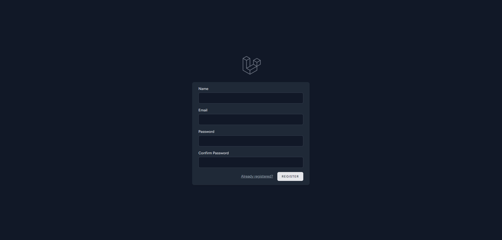
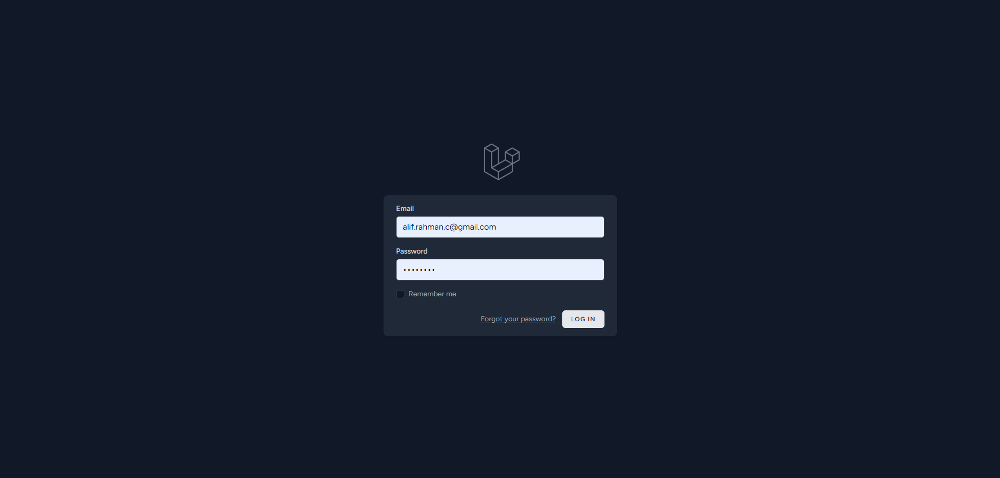
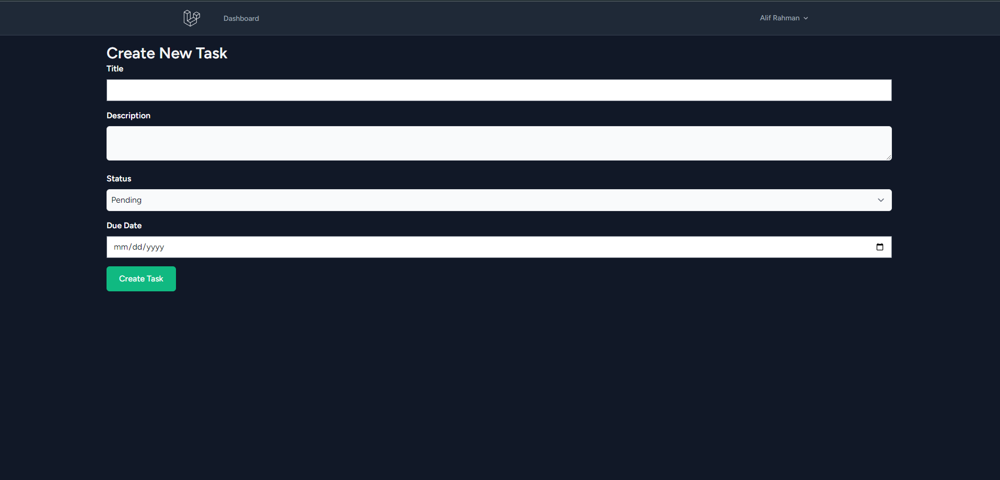
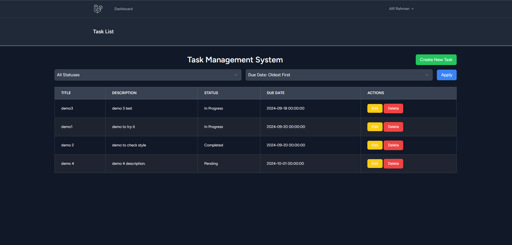
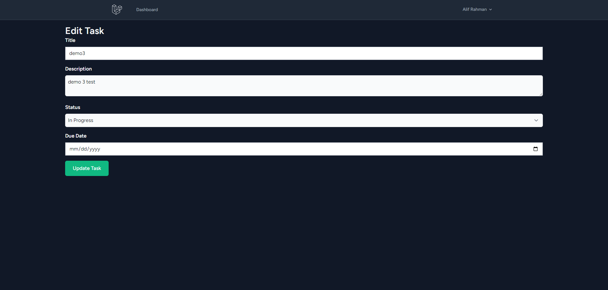
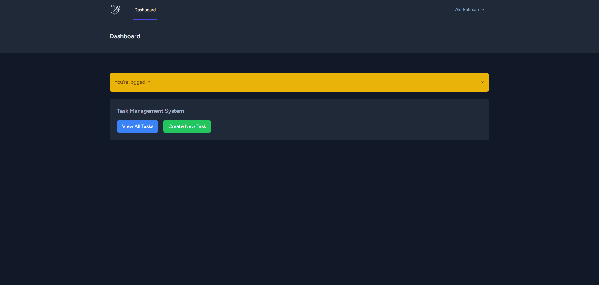

<p>
    
    
</p>


# Task Management System 
## Overview

This Task Management System allows users to manage tasks with full CRUD (Create, Read, Update, Delete) functionality, along with task filtering and sorting. Additionally, it provides a RESTful API for interaction with other applications. Users can register, log in, and manage their tasks through a user-friendly interface.

## Features

1. **User Authentication**
   - Register: Users can create a new account.
    
   - Log In: Users can log in to their account.
     
   - Log Out: Users can log out from their account.

2. **Task CRUD Operations** 
   - **Create**: Users can add new tasks.
   
   - **Read**: Users can view a list of tasks.
   
   - **Update**: Users can edit existing tasks.
   
   - **Delete**: Users can remove tasks.

3. **Task Filtering and Sorting**
   - **Filter**: Filter tasks by status (e.g., Pending, In Progress, Completed).
   - **Sort**: Sort tasks by due date.
   

4. **API Development**
   - A RESTful API is available for interacting with the task management system from external applications.

## Requirements

- PHP 8.x
- Laravel 10.x
- Composer
- MySQL or another supported database

## Installation
1. **Clone the Repository**
    
   ```bash
   git clone https://github.com/your-repository/task-manager.git
   cd task-manager
   
2. **Install Dependencies**
    
   ```bash
   composer install
   
3. **Set Up Environment & Copy the .env.example file to .env & Generate a new application Key: **
       
   ```bash
   composer install
----
           cp .env.example .env
           php artisan key:generate

5. **Configure Database**

   ```env
    DB_CONNECTION=mysql
    DB_HOST=127.0.0.1
    DB_PORT=3306
    DB_DATABASE=your_database
    DB_USERNAME=your_username
    DB_PASSWORD=your_password
   
6. Run Migrations
   
   ```bash
   php artisan migrate
   
8. **Install Laravel Sanctum & Add Sanctum middleware to api middleware group in app/Http/Kernel.php:**

   ```bash
       composer require laravel/sanctum
       php artisan vendor:publish --provider="Laravel\Sanctum\SanctumServiceProvider"
       php artisan migrate
----
            'api' => [
                \Laravel\Sanctum\Http\Middleware\EnsureFrontendRequestsAreStateful::class,
                'throttle:api',
                \Illuminate\Routing\Middleware\SubstituteBindings::class,
            ],

## usage
Web Interface

1. Register
   - Navigate to /register to create a new account.
2. Log In
   - Navigate to /login to log in.
3. Manage Tasks
   - Navigate to /tasks to view the list of tasks.
   - Use the "Create New Task" button to add a new task.
   - Use the edit button to modify existing tasks.
   - Use the delete button to remove tasks.
4. Filter and Sort Tasks
   - Use the filter dropdown to select task statuses.
   - Use the sort dropdown to order tasks by due date.

## API Endpoints

- Login
  - Endpoint: POST /api/login
  - Parameters:
    - email: User's email address.
    - password: User's password.
      
  - Response: Returns a JSON object with an API token.

- Logout
  - Endpoint: POST /api/logout
  - Authentication Required: Yes
  - Response: Returns a JSON message confirming logout.

- Tasks
  - List Tasks
    - Endpoint: GET /api/tasks
    - Authentication Required: Yes
      
  - Create Task
    - Endpoint: POST /api/tasks
    - Parameters:
      - title: Title of the task.
      - description: Description of the task (optional).
      - status: Status of the task.
      - due_date: Due date of the task (optional).
    - Authentication Required: Yes
      
  - View Task
    - Endpoint: GET /api/tasks/{task}
    - Parameters:
      - task: Task ID.
    - Authentication Required: Yes
      
  - Update Task
    - Endpoint: PUT /api/tasks/{task}
    - Parameters:
      - task: Task ID.
      - title: Title of the task.
      - description: Description of the task (optional).
      - status: Status of the task.
      - due_date: Due date of the task (optional).
    - Authentication Required: Yes
      
  - Delete Task
    - Endpoint: DELETE /api/tasks/{task}
    - Parameters:
      - task: Task ID.
    - Authentication Required: Yes

## **Running the Application & Testing**
To start the local development server, use:

    php artisan serve
    php artisan test

## Social Media

[](https://www.facebook.com/alif.facebook)
[](mailto:alif.rahman.c@gmail.com)
[](https://wa.me/+8801300155542)

## Contributing
Feel free to contribute to this project by submitting issues or pull requests. For more details, see CONTRIBUTING.md.

## License
This project is licensed under the MIT License. See the LICENSE.md file for details.
